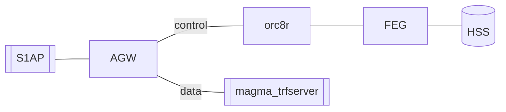
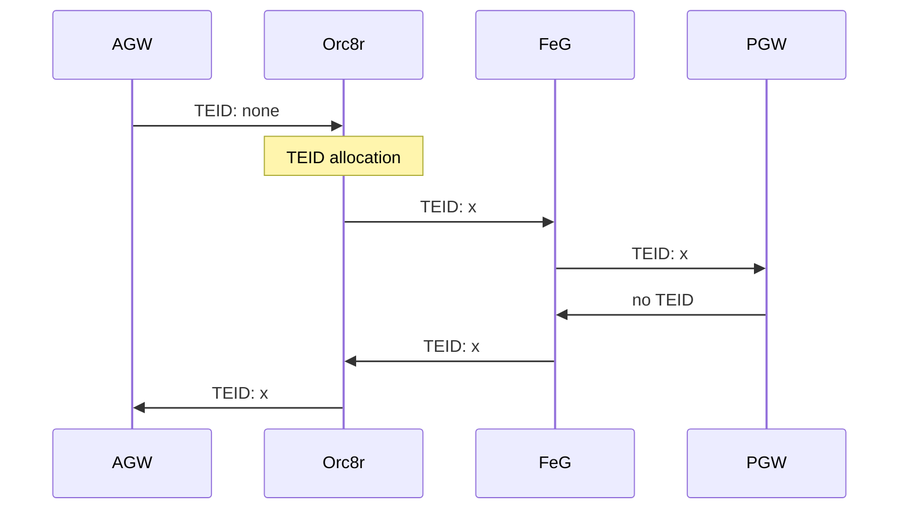

# magma-mermaid

```mermaid
graph LR;
    A[[S1AP]] --- AGW ---|control| orc8r --- FEG --- HSS[(HSS)];
    AGW ---|data| Z[[magma_trfserver]];
```

```mermaid
sequenceDiagram
    AGW->>Orc8r: TEID: none
    Note over Orc8r: TEID allocation
    Orc8r->>FeG: TEID: x
    FeG->>PGW: TEID: x
    PGW->>FeG: no TEID
    FeG->>Orc8r: TEID: x
    Orc8r->>AGW: TEID: x
```

